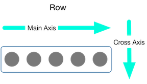

## Flutter for Android

### View

In the flutter, the equivalence of **View** in Android is **Widget**.  

To update the **Widget**:

- If a widget is **Stateless**, then it can not be updated.
- Else it is a **stateful** widget.

### Layout in flutter

The most important point of layout in flutter is the following:  

- Widgets to build UIs.
- Widgets are used for both layouts and UI elements.   
- Use some simple widgets to build complex widgets.  

#### Layout multiple widgets vertically and horizontally

- 2 most important widgets is **Row** and **Column**. These 2 widgets hold a list of widgets
and we can arrange the children to use the available space of widgets.

- To align the widgets, we mainly use **mainAxisAlignment** and **crossAxisAlignment**. The following picture
show the definition of these two properties.  

- For sizing the widgets, we use **flex** to set the flex factor of a widget.

Some common widgets in **Flutter**:

- Container
- GridView
- ListView
- Stack
- Card
