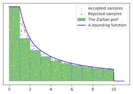

# Monte Carlo Methods

## Review of Probability Theory

### Discrete Random Variables

- Expected Value: $E(x) = \sum_{i=1}^n p_i x_i$.
- Variance: $\sigma^2 = E[(x - E(x))^2]$

### Continuous Random Variables

- Expected Value: $\int_{-\infty}^{\infty}xp(x)dx$
- Variance: $\sigma^2 = E[(x - E(x))^2] = \int(x-E(x))^2p(x)dx$

### Conditional and Marginal Probabilities

In this part we consider a pair of random variables $x$ and $y$. We have a joint probability distribution function $p(x, y)$.

- The marginal density function of $x$ is defined as: $p(x) = \int p(x, y)dy$
- The conditional density function: $p(y|x) = \frac{p(x,y)}{p(x)} = \frac{p(x,y)}{\int p(x,y)dy}$

### Chebyshev Inequality

Firstly we will introduce **Markov Inequality**.
- Markov Inequality: If $X > 0$ and $a > 0$, then $p(X \geq a) \leq \frac{E[X]}{a}$.

Proof:  

$$E[X] = E[x | x \geq a]p(x \geq a) + E[x | x < a]p(x < a)$$
$$\geq E[x|x \geq a]p(x \geq a) \geq ap(x \geq a)$$

Then we prove that:  

$$p(x \geq a) \leq \frac{E[X]}{a}$$  

After we know **Markov Inequality**, we will go to introducing **Chebyshev Inequality**.  

- Chebyshev Inequality: $p(|x-\mu| \geq c) \leq \frac{\sigma^2}{c^2}$.

$$p(|x-\mu| \geq c) = p[(x-\mu)^2 \geq c^2]$$

Applying **Markov Inequality**, we will get that:  

$$p(|x-\mu| \geq c) \leq \frac{E[(x-\mu)^2]}{c^2} = \frac{\sigma^2}{c^2}$$

## Monte Carlo Integration

### Basics of Monte Carlo methods

Firstly assume that we have $N$ random variables $g(x_1), ..., g(x_N)$. The $x_i$ variables are independent with each other. Assume that the weighted sum of these variables is $G(x)$.

$$G(x) = \sum_{i=1}^N w_ig(x_i)$$

Assume that each of $x$ has the same weight, $w_i = \frac{1}{N}$.

The expected value of $G(x)$ is that:  

$$E[G(x)] = \sum_i w_i g(x_i) = \frac{1}{N} \sum_{i=1}^{N}E[g(x)] = E[g(x)]$$

Then the variance of $G(x)$ is that:  

$$\sigma^2(G(x)) = \sigma^2(\sum_i\frac{g(x_i)}{N}) = \frac{\sigma^2(g(x))}{N}$$

That means, the variance of $G(x)$ will decrease as the number of samples $N$ increases.  

### Sampling Random Variables

#### Continuous Random Variables

For continuous random variables, we use the following strategy to do the sampling:  

```
Pick u uniformly from [0, 1)
return y = F.inverse(u)
```

Currently, $F = \int_{-\infty}^y p(x)dx$, we want to prove the following things:  

$$Pr[y \leq Y] = \int_{-\infty}^Y p(x)dx$$

Proof:  

For uniform distribution, we have the following things:  

$$Pr[u \leq X] = X$$

Then, we will have:  

$$Pr[F^{-1}(u) \leq F^{-1}(X)] = X$$
where $X = F(Y)$.
As a result, we have:  
$$Pr[y \leq Y] = F(Y) = \int_{-\infty}^Y p(x)dx$$

#### Rejection Sampling

Sometimes we do not have analytical solution of the distribution we want to sample, then we have **Rejection Sampling** for us to do the job at this time.  

Assume that we have a distribution in the domain $[a, b]$, and the maximum $pdf$ in this domain is $M$. Then we will do the following things:  
```
Compute sample x uniformly from domain of x
Compute sample u uniformly from [0, 1)
if u < p(x) / M:
   return x
else reject sample
```


### Variance Reduction

One main goal of monte carlo methods is to reduce variance. There are serval ways to handle these problems.  

#### Stratified Sampling

The basic idea of **Stratified Sampling** is to divide the whole domain of integration into serveral subdivisions.  

Consider we want to integrate a function over $[0, 1]$, then after **Stratified Sampling**, we will have an array $A$, which divides the integration domain, that is:  

$$\int_0^1 f(x)dx = \sum_{i=1}^m \int_{a_{i-1}}^{a_i} f(x)dx$$
$$a_0 = 0, a_m = 1$$

Currently we are interested in variance of sampling, the variance before we use **Stratified Sampling** is:  

$$\sigma_1^2 = \frac{1}{N} \int_0^1 f(x)^2dx - (\int_0^1 f(x)dx)^2$$

After we do **Stratified Sampling**, we will get that:  

$$\sigma_2^2 = \sum_{i=1}^m \sigma^2(f(x))$$
$$= \sum_{i=1}^m \frac{a_i - a_{i-1}}{n_i} \int_{a_{i-1}}^{a_i}f(x)^2 dx - \sum_{i=1}^m \frac{1}{n_i}(\int_{a_{i-1}}^{a_i}f(x)dx)^2$$

We can easily find that:  

$$\sigma_1^2 \geq \sigma_2^2$$

#### Importance Sampling

**Importance Sampling** means that we use some distribusion other than **uniform sampling** to generate samples. The estimator can be written in the following form:  

$$<I> = \frac{1}{N}\sum_{i=1}^N \frac{f(x_i)}{p(x_i)}$$

#### Multiple Importance Sampling

**Multiple Importance Sampling** means that for each sample, we will use different estimators with potentially different weights to sample it. The overall function of **Multiple Importance Sampling** is like below:  

$$F = \frac{1}{N} \sum_{i=1}^n \sum_{j=1}^{n_i} \frac{f(x_{i,j})}{\sum_kc_kp_k(X_{i,j})}$$

Note that $N = \sum_i n_i$ is the total number of samples and $c_k = \frac{n_k}{N}$ is the fraction of samples from kth estimator.