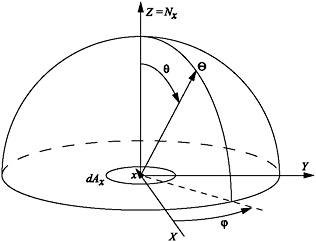
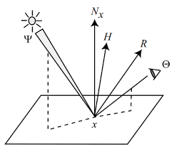

# Basics Of Global Illumination

## Solid Angle

To get to know **Solid Angle**, firstly we have to know **Hemispherical Coordinates**.  

In **Hemispherical Coordinates**, we express the 3D position with $(r, \phi, \theta)$. 

- r: Radius
- $\phi$: Azimuth
- $\theta$: Elevation

If we want to transfer **Hemispherical Coordinates** to **Cartesian Coordinates**, clearly we will have the following formulas:  

$$x = rcos\phi sin\theta$$
$$y = rsin\phi sin\theta$$
$$z = rcos\theta$$

Then we define the **Solid Angle** $\Omega$ subtended by an area on the hemisphere as the following:  

$$\Omega = \frac{A}{r^2}$$

Then **Solid Angle** subtended by a surface or object can be defined as the following:  

$$\Omega = \frac{Acos\alpha}{d^2}$$

The **Differential Solid Angle** is written as:  

$$d\omega_d = sin\theta d\theta d\phi$$

## Radiometry

- Flux: Radiant power, noted as $\Phi$.
- Irradiance: Incident radient power on a surface, per unit surface area, noted as E.
$$E = \frac{d\Phi}{dA}$$
- Radiance: Flux per unit **projected** area per unit solid angle.  
$$L = \frac{d^2\Phi}{d\omega dA^{\perp}} = 
\frac{d^2\Phi}{d\omega dA cos\theta}$$
$$\theta \text{ is the angle between surface normal and incident direction}$$

As the definitions above, we can formulate these terms like following:  

$$\Phi = \int_A \int_{\Omega} L(x \rightarrow \Theta) cos\theta d\omega_{\Theta}dA_x$$
$$E(x) = \int_{\Omega} L(x \rightarrow \Theta) cos\theta d\omega_{\Theta}$$

### Properties of Radiance
  - Radiance is invariant along straight paths. $L(x \rightarrow y) = L(y \rightarrow x)$
  - Sensors are sensitive to radiance.  

We prove the first property in the following:  

$$L(x \rightarrow y) = \frac{d^2\Phi}{d\omega_{x \leftarrow A_y}cos\theta_x dA_x}$$
$$d^2\Phi = L(x \rightarrow y) d\omega_{x \leftarrow A_y}cos\theta_x dA_x$$

In this same way, we will get:  
$$d^2\Phi = L(x \leftarrow y) d\omega_{y \leftarrow A_x}cos\theta_y dA_y$$

And differential solid angle will be:  

$$d\omega_{x \leftarrow dA_y} = \frac{cos \theta_y dA_y}{r_{xy}^2}$$
$$d\omega_{y \leftarrow dA_x} = \frac{cos \theta_x dA_x}{r_{xy}^2}$$

Put everything together, we will get:  

$$L(x \rightarrow y) = L(y \leftarrow x)$$

## Interaction of Light with Surfaces

### BRDF

- A assumption: Light incident at a surface and left a surface.   

We define BRDF as the following:  

$$f_r(x, \Phi \rightarrow \Theta) = \frac{dL(x \rightarrow \Theta)}{dE(x \leftarrow \Phi)} = \frac{dL(x \rightarrow \Theta)}{L(x \leftarrow \Phi)cos(N_x, \Phi)d\omega_{\Phi}}$$  

Thus, we will get the following function:  

$$ L(x \rightarrow \Theta) = \int_{\Omega_x} f_r(x, \Phi \rightarrow \Theta) L(x \leftarrow \Phi) cos(N_x, \Phi)d\omega_{\Phi}$$

### Energy Conservation

The total power per unit area leaving the surface $M$:  

$$M = \int_{\Omega_x} L(x \rightarrow \Theta) cos(N_x, \Theta)d \omega_{\Theta}$$

Put $L$ in this function, then we will get that:  

$$M = \int_{\Omega_x} \int_{\Omega_x} f_r(x, \Phi \rightarrow \Theta) L(x \leftarrow \Phi) cos(N_x, \Phi) cos(N_x, \Phi) d\omega_{\Phi}d\omega_{\Theta}$$

For energy conservation law, we will have the following formula:  

$$\frac{M}{E} \leq 1$$

## Rendering Equation

As we discussed above, all global illumination algorithms aim to compute the steady state distribution of light energy. Precisely, we want to calculate the exitant radiance $L(x \rightarrow \Theta)$.

- For energy conservation, the total outgoing radiance should be the sum of emitted radiance and reflected radiance:  

$$L(x \rightarrow \Theta) = L_e(x \rightarrow \Theta) + L_r(x \rightarrow \Theta)$$

Putting the definition of **BRDF** into this function, we will get that:  

$$L(x \rightarrow \Theta) = L_e(x \rightarrow \Theta) + \int_{\Omega_x}f_r(x, \Phi \rightarrow \Theta) cos(N_x, \Phi)d\omega_{\Phi}$$
