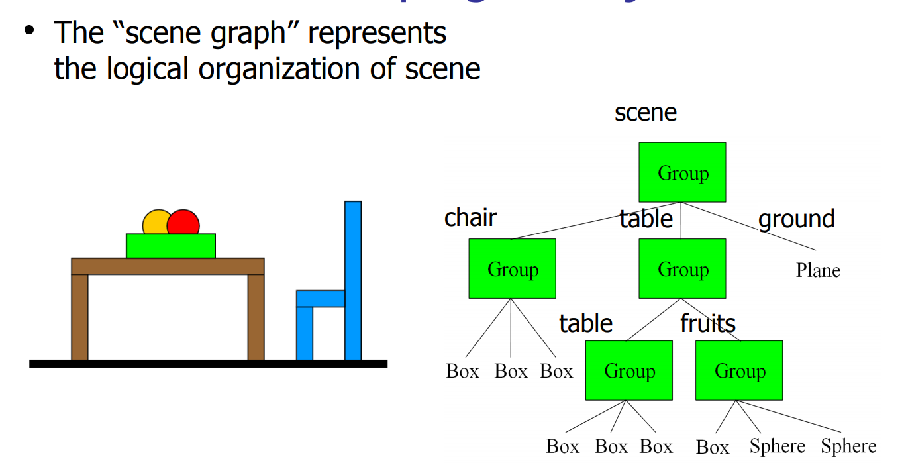

# Hierarchical Modeling

- We use **Hierarchical Modeling** to create complex world scene by combining simple primitive shapes into more complex aggregate objects.

## Scene graph



- Convenient Data Structure for scene representation
  - Geometry
  - Transformation
  - Materials, color

- Use DAG(Directed Acyclic Graph) for model representation
  - Reuse simple object models

### Scene Graph Traversal

- DFS: visite node, then visit subtrees.
- When visiting a geometry node: Just Draw it.

Handle the transformation
```python
def traversal(S, T):
  S.push(T)
  for (child: S):
    traversal(S, child.getT())
  S.undo(T)
```
## Articulated Models


- Articulated models: Rigid parts connected by joints.
- Articulated models can be animated by specifying the joint angles as functions of time.

### Joints and bones

- Describe the positions of the body parts as a function of joint angles.
